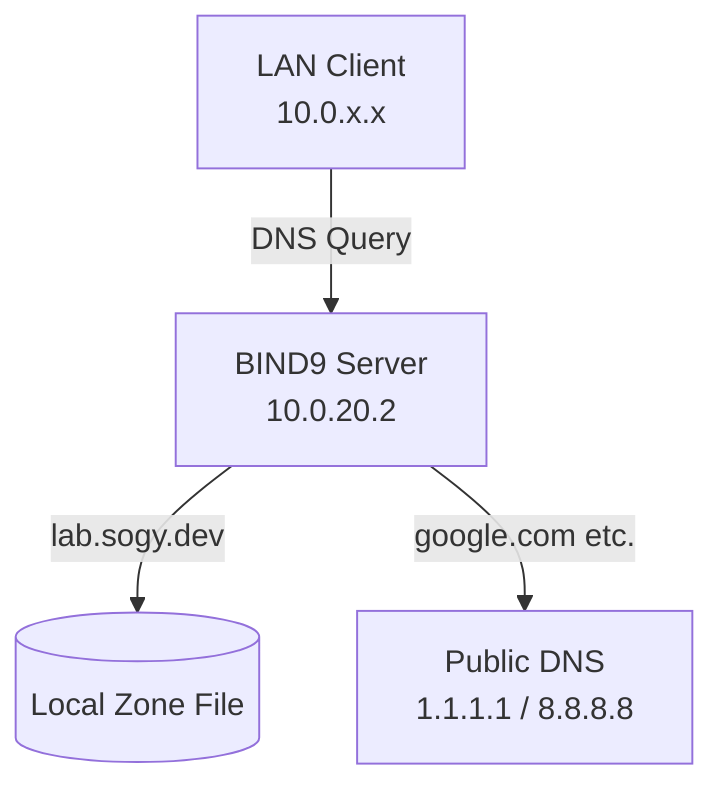

# [Network] BIND9 DNS Server (Authoritative / Cache)

## 1. Context (Why)

* **目的**: LAN内 (`10.0.0.0/16`) の名前解決を一元管理し、カスタムドメイン (`lab.sogy.dev`) を利用可能にするため。
* **役割**:
  * **Authoritative**: 自ドメイン (`lab.sogy.dev`) の正引き・逆引き。
  * **Recursion/Forwarding**: 外部ドメインの問い合わせを上位DNSへ転送、または自身で解決。

### Architecture



## 2. Prerequisites

* **Server OS**: Ubuntu Server 24.04.3 LTS
* **Network**:
* IP: `10.0.20.2` (Static IP configured via Netplan)
* Hostname: `ns1` (recommended)

* **Target Domain**: `lab.sogy.dev`
* **Software Version**: BIND 9.18.39

## 3. Architecture & Files

* **Config Strategy**:
* Options: `/etc/bind/named.conf.options` (ACL, Forwarders, Listen設定)
* Local: `/etc/bind/named.conf.local` (Zone定義)
* Zone Data: `/var/lib/bind/db.lab.sogy.dev` (実際のレコード情報)

* **Files Mapping**:
* Repository: `./files/` -> Server Configs

## 4. Steps (How)

### 4.1 Installation

必要なパッケージをインストールします。

```bash
sudo apt update
sudo apt install bind9 bind9-utils bind9-doc -y

# 動作確認
systemctl status named

```

### 4.2 Configuration

以下の定義に従い、サーバー上の設定ファイルを構成してください。
※適用方法は環境に合わせて選択してください（エディタでの編集、scp、Ansible等）。

**1. Options設定**
ACL（アクセス許可ネットワーク）や転送先の設定を行います。

* **Target File**: `/etc/bind/named.conf.options`
* **Reference**: [./files/named.conf.options](./files/named.conf.options)

**2. Local Zone定義**
このサーバーが管理するドメイン（ゾーン）を定義します。

* **Target File**: `/etc/bind/named.conf.local`
* **Reference**: [./files/named.conf.local](./files/named.conf.local)

**3. Zoneファイル作成**
実際のレコード（Aレコード等）を記述したファイルを作成します。

* **Target File**: `/var/lib/bind/db.lab.sogy.dev`
* **Reference**: [./files/db.lab.sogy.dev](./files/db.lab.sogy.dev)

> [!WARNING]
> ゾーンファイルの配置場所はディストリビューションのポリシーに従い `/var/lib/bind/` または `/etc/bind/` を適切に使用してください（本手順では動的更新の可能性を考慮し `/var/lib/bind/` を推奨）。

### 4.3 Validation & Apply

設定ミスによる起動失敗を防ぐため、必ず構文チェックを行います。

**1. 構文チェック**

```bash
# 設定ファイル全体の構文チェック (何も表示されなければOK)
sudo named-checkconf

# ゾーンファイルの構文チェック (OKが表示されること)
# Usage: named-checkzone <domain> <file_path>
sudo named-checkzone lab.sogy.dev /var/lib/bind/db.lab.sogy.dev

```

**2. 適用**

```bash
sudo systemctl restart named
sudo systemctl enable named

```

**3. Firewall設定 (UFW有効時)**

```bash
sudo ufw allow Bind9
# または
sudo ufw allow 53/tcp
sudo ufw allow 53/udp

```

## 5. Client Configuration (Ubuntu Desktop)

クライアントがこのDNSサーバーを参照するように設定します。

**Option A: Netplan (Permanent)**
`/etc/netplan/` 配下の設定ファイルを編集し、`nameservers` を指定します。

```yaml
network:
  ethernets:
    enp3s0:
      nameservers:
        addresses: [10.0.20.2]

```

**Option B: Systemd-resolved (Temporary/GUI)**
GUIのネットワーク設定、または `resolvectl` コマンドで確認します。

## 6. Verification

クライアント端末、またはサーバー自身から名前解決ができるか確認します。

```bash
# 正引きテスト
dig @10.0.20.2 lab.sogy.dev +short
# -> 10.0.20.2 が返ること

# 外部ドメインテスト
dig @10.0.20.2 google.com +short
# -> IPアドレスが返ること（Forwarding確認）

# ログ確認 (エラー時)
sudo journalctl -u named -f

```

## 7. Operations

* **レコード追加時**:

1. `/var/lib/bind/db.lab.sogy.dev` を編集し、レコードを追加。
2. **Serial番号をインクリメントする**（必須）。
3. `sudo named-checkzone lab.sogy.dev /var/lib/bind/db.lab.sogy.dev`でZone fileの検証
4. `sudo systemctl reload named` を実行。

## 8. References

* [BIND 9 Administrator Reference Manual](https://bind9.readthedocs.io/en/latest/)
* [Ubuntu Server Guide - DNS](https://ubuntu.com/server/docs/service-domain-name-service-dns)
