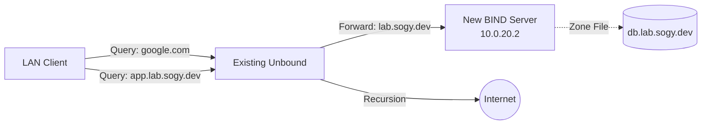

# [WIP] BIND Install

* Date: 2026-01-09
* Status: Solved

## 1. やりたいこと (Objective)


# 🏗️ Scrap: BIND9 Authoritative DNS on Ubuntu 24.04

* **Date**: 2026-01-09
* **Status**: ✅ Completed
* **Environment**:
* **OS**: Ubuntu Server 24.04 LTS
* **Software**: BIND 9.18.39
* **Role**: Authoritative DNS for `lab.sogy.dev`
* **IP**: `10.0.20.2`

## 2. 現状・発生している問題 (Issue)

なし

## 3. 仮説・試したこと (Log)

`systemd-resolved` との競合を避けるため、OS標準のリゾルバを無効化し、BINDがPort 53を専有する構成を採用。



手順 1: systemd-resolved の無効化と DNS設定の確保

```bash
# 1. サービスを停止し、自動起動もオフにする
sudo systemctl disable --now systemd-resolved

# 2. デフォルトのシンボリックリンクを削除（これが残っていると解決できなくなる）
sudo unlink /etc/resolv.conf

# 3. 一時的なDNSサーバーを指定（インストール用）
# ※既存のUnboundがあるならそのIPでも良いが、確実性のため8.8.8.8を使う
echo "nameserver 8.8.8.8" | sudo tee /etc/resolv.conf

# 4. 53番ポートが空いたか確認（何も表示されなければOK）
sudo ss -tulpn | grep :53
```

手順 2: BIND9 のインストール

```bash
sudo apt update
sudo apt install bind9 bind9utils bind9-doc -y
```

起動確認

```bash
# ステータス確認
sudo systemctl status named

# 再度ポート確認（今度はnamedが表示されるはず）
sudo ss -tulpn | grep :53
```

BackUpしておく(リカバリが楽)
```bash
sudo cp /etc/bind/named.conf.options /etc/bind/named.conf.options.bak
```

### 3.1 ACL & Options (`/etc/bind/named.conf.options`)

LAN内からの問い合わせのみを許可し、オープンリゾルバ化を防ぐ。
/etc/bind/named.conf.optionsを編集する
設定値は[named.conf.options](./files/named.conf.options)を確認してね
このファイルはgithubにあってローカルにはないよ。
だからGitHubのMD上でリンクになるようにしようね

構文チェック
```bash
sudo named-checkconf
```

### 3.2 Zone Declaration (`/etc/bind/named.conf.local`)

Zoneファイルの宣言
これでZoneFileをBINDが認識できるようにする
`/etc/bind/named.conf.local`を編集する。
設定値は[named.conf.local](./files/named.conf.local)を確認してね

逆引きしたかったらここで書く

### 3.3 Zone File (`/etc/bind/zones/db.lab.sogy.dev`)

Zone File作成
一応ZoneFile増えてもいいようにそれ用のディレクトリ切る
```bash
# ディレクトリ作成
sudo mkdir -p /etc/bind/zones
```

zone fileを作って編集する(db.{載せたいドメインとかにしようね})
```bash
sudo touch /etc/bind/zones/db.lab.sogy.dev
```

設定値は[db.lab.sogy.dev](./files/db.lab.sogy.dev)を確認してね

## 4. Finalize & Verify

### 4.1 Apply Changes

構文チェック
```bash
sudo named-checkconf
```

ゾーンファイルのチェック
```bash
sudo named-checkzone lab.sogy.dev /etc/bind/zones/db.lab.sogy.dev
```

再起動&正常性確認
```bash
sudo systemctl restart named
sudo systemctl status named
```

### 4.2 Self-Resolution Setup

サーバー自身が自分（BIND）を使って名前解決するように固定。
```bash
cat <<EOF | sudo tee /etc/resolv.conf
> nameserver 127.0.0.1
> EOF
```

### 4.3 Verification
```bash
# 1. 自分のドメイン（権威）のテスト
dig lab.sogy.dev

# 2. 外部ドメイン（再帰）のテスト
dig google.com

# 3. ラウンドロビンのテスト
dig app.lab.sogy.dev +short
```

## 4. 解決策・結論 (Solution)

## 5. 参考URL

* URL
